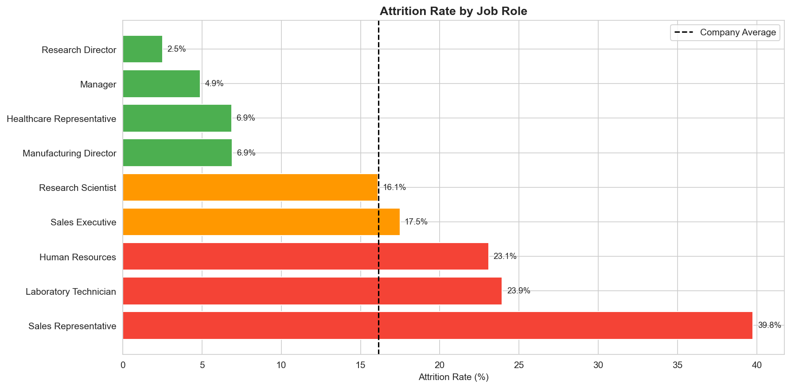
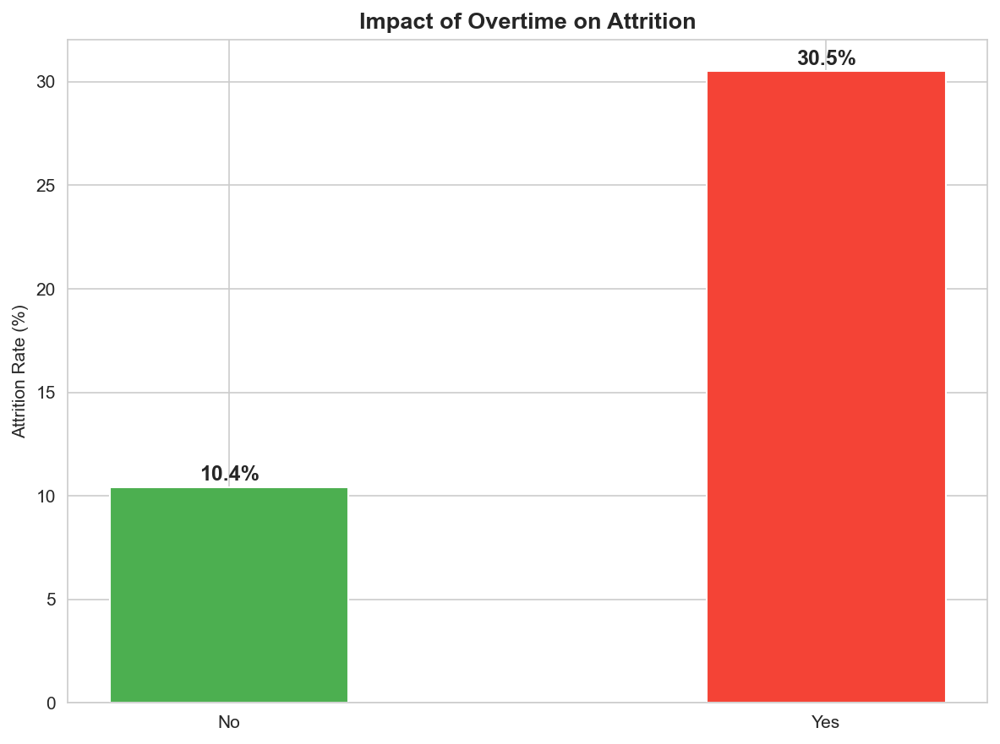
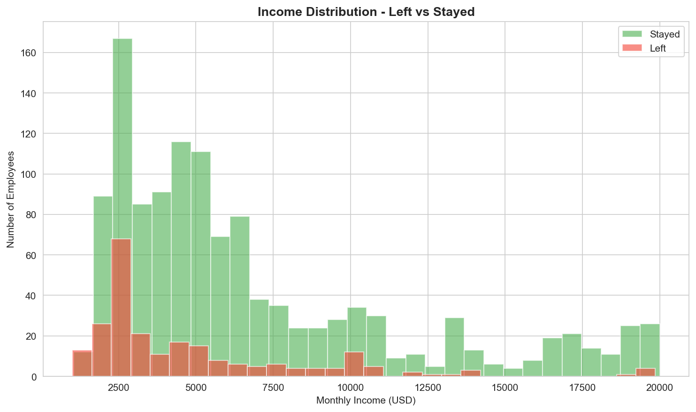
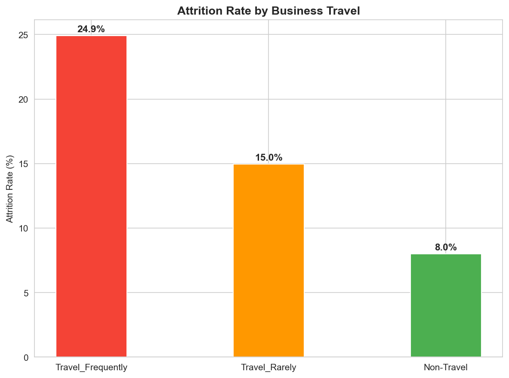
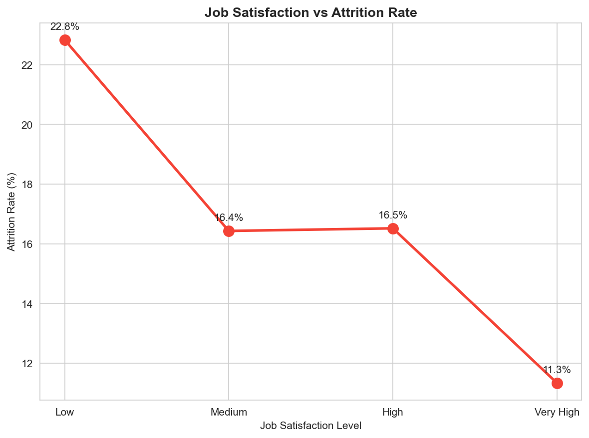

# HR Employee Attrition Analysis

**Tools Used:** Python, Pandas, Matplotlib, Seaborn
**Data Source:** IBM HR Analytics Dataset
**Dataset Size:** 1,470 employees, 35 columns

---

## Problem Statement
A company is losing 16% of its employees annually.
This analysis identifies the key factors driving attrition
and provides actionable recommendations to HR leadership.

---

## Data Cleaning Steps
1. Dropped 3 useless columns with zero variation
   (EmployeeCount, Over18, StandardHours)
2. Converted Attrition Yes/No to 1/0 for calculations
3. Converted OverTime Yes/No to 1/0 for calculations

---

## Key Findings

1. **Sales Representatives have 39.76% attrition**
   Nearly 4 out of 10 sales reps quit every year

2. **Overtime is the strongest attrition driver**
   Employees doing overtime leave at 30.53% vs 10.44%
   That is a 3x difference

3. **Employees who left earned 30% less**
   Average income of leavers: $4,787
   Average income of stayers: $6,832

4. **Younger employees leave more**
   Average age of leavers: 33.6 years
   Average age of stayers: 37.6 years

5. **Frequent travelers leave at 24.91%**
   vs 8% for non-travelers

6. **Low job satisfaction doubles attrition**
   Low satisfaction: 22.84% attrition
   High satisfaction: 11.33% attrition

---

## Business Recommendations

1. **Eliminate or reduce mandatory overtime**
   Overtime is the single strongest predictor of attrition
   3x higher leaving rate is a serious operational risk

2. **Review Sales Representative compensation**
   39.76% attrition in this role is unsustainable
   Benchmark salaries against market rates immediately

3. **Create retention program for employees under 35**
   Younger employees leave faster and more frequently
   Mentorship and career growth programs will help

4. **Reduce unnecessary business travel**
   Every increase in travel frequency increases attrition
   Use video conferencing where possible

---

## Visualizations

---

## How To Run
git clone https://github.com/surendrasinghdata/hr-attrition-analysis
cd hr-attrition-analysis
python3 -m venv venv
source venv/bin/activate
pip install pandas matplotlib seaborn
python3 notebooks/step1_explore.py
python3 notebooks/step2_cleaning.py
python3 notebooks/step3_analysis.py
python3 notebooks/step4_visualization.py
